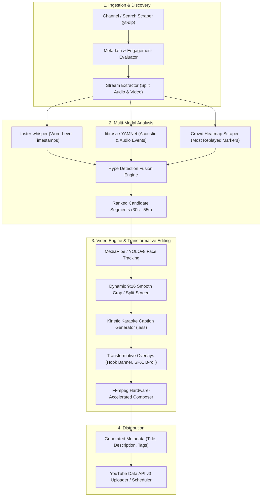

# System Architecture & Technical Specifications

## 1. System Overview

`Content Agent` is an autonomous, self-hosted pipeline that automates the conversion of horizontal (16:9) long-form videos into high-retention, transformative vertical (9:16) YouTube Shorts.

The pipeline replaces proprietary SaaS tools (Opus Clip, Submagic, Klap, InVideo) with a modular open-source toolchain running locally or on a standard Linux/Windows machine.

---

## 2. High-Level Pipeline Architecture



---

## 3. Detailed Component Breakdown

### 3.1. Ingestion Layer (`src/ingestion/`)
*   **Video Discovery:** Uses `yt-dlp` to query target creators or niches (e.g., podcasts, interviews, tech talks) for videos meeting velocity thresholds (e.g., >100k views within 7 days, or high view-to-subscriber ratios).
*   **Decoupled Extraction:** Downloads the fastest suitable streams:
    *   16kHz mono `.wav` for Whisper and acoustic processing.
    *   1080p `.mp4` video stream for framing and final cut.
*   **Heatmap Extractor:** Pulls YouTube's public "Most Replayed" player interaction curve.

### 3.2. Transcription Layer (`src/transcription/`)
*   **Engine:** `faster-whisper` (CTranslate2 implementation of OpenAI Whisper).
*   **Performance:** 4x faster than vanilla Whisper with significantly lower VRAM usage.
*   **Output:** JSON structure preserving word-level precision:
    ```json
    {
      "word": "insane",
      "start": 14.28,
      "end": 14.65,
      "probability": 0.98
    }
    ```

### 3.3. Hype Detection Engine (`src/hype_detector/`)
*   Multi-signal fusion model that scores every time-window across 5 dimensions:
    1.  **Crowd-Sourced Engagement:** Heatmap curve peaks.
    2.  **Semantic Hook & Narrative Arc:** LLM prompt evaluating hook strength, clarity, and climax.
    3.  **Acoustic Peaks:** Loudness (RMS), pitch variance ($F_0$), and speech acceleration (WPM).
    4.  **Audio Events:** Detection of laughter, gasps, applause, or interruptions.
    5.  **Visual Motion:** Optical flow and facial expression dynamics.
*   *Detailed specification in [`docs/HYPE_DETECTION_ENGINE.md`](HYPE_DETECTION_ENGINE.md).*

### 3.4. Video Engine (`src/video_engine/`)
*   **Active Speaker Tracking:**
    *   Runs `MediaPipe Face Detection` or `YOLOv8-face` on keyframes.
    *   Calculates bounding boxes of speakers.
    *   Applies Exponential Moving Average (EMA) to prevent camera jitter:
        $$\text{Center}_t = \alpha \cdot \text{FaceX}_t + (1 - \alpha) \cdot \text{Center}_{t-1}$$
*   **Multi-Speaker Layouts:**
    *   *Single speaker:* Smooth centered 9:16 crop.
    *   *Two speakers (interview):* Stacked 9:16 layout (Speaker A on top half, Speaker B on bottom half).
*   **Kinetic Subtitles:**
    *   Compiles word timestamps into an Advanced SubStation Alpha (`.ass`) subtitle script.
    *   Styles: Custom typography (Montserrat-Black / TheBoldFont), color highlighting of current active word, drop shadow, and bounce animations.
*   **Transformative Enhancements (Reused Content Prevention):**
    *   Header title card with contextual question/hook.
    *   Audio normalization via FFmpeg `loudnorm` filter.
    *   Subtle ambient background music ducking.
    *   Micro-zooms (1.1x) on emphasis words.

### 3.5. Publishing Layer (`src/publisher/`)
*   **Metadata Generation:** LLM writes 3 click-worthy YouTube Short titles, an SEO-optimized description with hashtags, and timestamps.
*   **YouTube Data API v3:** Handles OAuth2 refresh tokens, uploads the `.mp4` file, sets `madeForKids=false`, and tags it as a Short with visibility set to unlisted (for manual review) or public/scheduled.

---

## 4. Directory Structure

```
Content Agent/
├── README.md
├── docs/
│   ├── ARCHITECTURE.md            # (This file)
│   ├── HYPE_DETECTION_ENGINE.md   # Algorithmic deep-dive into viral scoring
│   └── ROADMAP.md                 # Development sprint plan
├── config/
│   ├── settings.yaml              # Global thresholds, paths, model options
│   └── styles.yaml                # Subtitle colors, font sizes, layouts
├── assets/
│   ├── fonts/                     # Bold typography for subtitles
│   ├── music/                     # Royalty-free background audio
│   └── sfx/                       # Whooshes, pops, transition audio
├── src/
│   ├── __init__.py
│   ├── ingestion/
│   │   ├── finder.py              # Scrapes & filters viral candidate videos
│   │   ├── downloader.py          # yt-dlp wrapper for stream downloads
│   │   └── heatmap.py             # Scrapes & parses YouTube engagement heatmaps
│   ├── transcription/
│   │   └── transcriber.py         # faster-whisper word-level generator
│   ├── hype_detector/
│   │   ├── audio_energy.py        # RMS volume, pitch & speech rate analysis
│   │   ├── event_detector.py      # YAMNet laughter, applause & gasp detector
│   │   ├── llm_scorer.py          # LLM semantic hook & narrative arc analyzer
│   │   └── fusion.py              # Weighted composite scoring algorithm
│   ├── video_engine/
│   │   ├── tracker.py             # Face detection & EMA camera crop tracker
│   │   ├── layout.py              # Single speaker vs stacked split-screen logic
│   │   ├── subtitle_gen.py        # Word-level .ass kinetic subtitle generator
│   │   └── composer.py            # FFmpeg filter_complex rendering engine
│   └── publisher/
│       ├── metadata_gen.py        # LLM title, description & tag generator
│       └── yt_uploader.py         # YouTube Data API v3 uploader
├── tests/                         # Unit tests for individual modules
├── requirements.txt
└── main.py                        # CLI entry point to run pipeline
```
