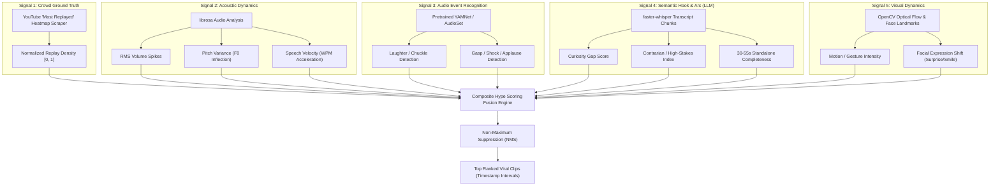

# Hype & Virality Detection Engine: Algorithmic Specification

## 1. Why Naive Methods Fail

Most simple video clippers rely on a single metric—either basic volume spikes (which misidentifies loud coughing or microphone bumps as "hype") or naive LLM summaries (which pick intellectually interesting points that lack emotional energy or visual pacing).

True viral short-form content relies on a **fusion of psychological, acoustic, and behavioral triggers**:
1.  **Immediate Hook (0–3 seconds):** Creates an irresistible curiosity gap or cognitive dissonance.
2.  **Emotional Dynamics:** Pitch variation, laughter, vocal intensity, or debate.
3.  **Narrative Cohesion:** A self-contained story arc with context, escalation, and payoff in 30–55 seconds.
4.  **Audience Proof:** High replay density in YouTube's viewer behavior logs.

---

## 2. The 5-Signal Hype Architecture



---

## 3. Signal Deep-Dive & Extraction Logic

### Signal 1: Crowd Ground Truth (YouTube Heatmap)
YouTube calculates viewer replays from millions of watch sessions and renders it as an SVG curve (`svg.ytp-heat-map-svg`) on the player.
*   **Extraction:** Parse the cubic Bézier curve paths ($d$ attribute) from the watch page or player response data.
*   **Transformation:** Map coordinate space to timestamp $t$ and normalize replay intensity:
    $$H_{\text{crowd}}(t) \in [0.0, 1.0]$$
*   *Advantage:* Direct empirical proof of human retention and engagement.

---

### Signal 2: Acoustic Dynamics (`librosa`)
Audio energy correlates with human passion, argument, and humor.

1.  **RMS Energy Spikes (Loudness):**
    $$RMS(t) = \sqrt{\frac{1}{N} \sum_{n=0}^{N-1} |x(n)|^2}$$
    Normalized via Z-score against the video's running baseline:
    $$Z_{\text{rms}}(t) = \frac{RMS(t) - \mu_{\text{rms}}}{\sigma_{\text{rms}}}$$
2.  **Pitch Variation ($F_0$ Inflection):**
    Monotone speech has low virality. Excited, questioning, or shocked speech exhibits wide pitch standard deviations:
    $$S_{\text{pitch}}(t) = \text{std}(F_0[t - \Delta t : t + \Delta t])$$
3.  **Speech Cadence / Words Per Minute (WPM):**
    Calculated using word-level timestamps from Whisper. Rapid acceleration (e.g., jumping from 130 WPM to 210 WPM) indicates emotional intensity, urgency, or excitement, often followed by a dramatic pause.

---

### Signal 3: Audio Event Recognition (`YAMNet` / `AudioSet`)
Trained on Google's AudioSet ontology (free, local, lightweight TensorFlow/PyTorch model):
*   Detects high-value acoustic events with timestamp precision:
    *   `Laughter` / `Chuckle` (indicates comedy punchlines)
    *   `Applause` / `Cheering` (indicates inspiring or consensus moments)
    *   `Gasp` / `Screaming` / `Groan` (indicates shock, horror, or dispute)
*   Outputs an event confidence multiplier $E_{\text{event}}(t) \in [1.0, 1.5]$.

---

### Signal 4: Semantic Hook & Narrative Arc (LLM Intelligence)
The Whisper transcript is analyzed in rolling 45-second sliding windows with a specialized prompt:

```text
Evaluate the following timestamped transcript for short-form virality (TikTok / YouTube Shorts):

1. HOOK STRENGTH (0-10): Does the first sentence contain an irresistible curiosity gap, 
   a contrarian stance, or an emotionally shocking premise?
2. STANDALONE CLARITY (0-10): Can a viewer understand this completely without seeing the rest of the video?
3. NARRATIVE PAYOFF (0-10): Is there a satisfying punchline, twist, or profound insight before the end?
4. RETENTION RISK (0-10): Does the clip contain boring filler words, awkward pauses, or abrupt cutoffs?

Output JSON:
{
  "hook_score": 8.5,
  "clarity_score": 9.0,
  "payoff_score": 8.0,
  "retention_risk": 2.0,
  "recommended_start": 142.5,
  "recommended_end": 187.2,
  "hook_category": "Contrarian Myth-Bust",
  "reasoning": "Speaker directly refutes standard advice and gives a 3-step proof."
}
```

*Formula for Semantic Score:*
$$S_{\text{semantic}} = \frac{(\text{Hook} \times 0.40) + (\text{Payoff} \times 0.35) + (\text{Clarity} \times 0.25) - (\text{Risk} \times 0.30)}{10}$$

---

### Signal 5: Visual Dynamics & Motion (Computer Vision)
*   **Optical Flow (`cv2.calcOpticalFlowFarneback`):** Measures pixel movement magnitude across frames. High motion indicates animated hand gestures, body language, or physical demonstrations.
*   **Facial Landmark Shifts (`MediaPipe FaceMesh`):** Measures rapid changes in eyebrow position (surprise/skepticism) and mouth aspect ratio (laughter/shouting).

---

## 4. The Composite Fusion Scoring Formula

For any candidate window $W_i = [t_{\text{start}}, t_{\text{end}}]$ between **30 and 55 seconds**:

$$\text{Final Hype Score}(W_i) = w_1 \cdot \bar{H}_{\text{crowd}} + w_2 \cdot S_{\text{semantic}} + w_3 \cdot \bar{Z}_{\text{rms}} + w_4 \cdot \bar{S}_{\text{pitch}} + w_5 \cdot \bar{M}_{\text{visual}} + \text{Bonus}_{\text{events}}$$

### Default Calibration Weights:
*   $w_1 = 0.35$ (Crowd Heatmap — empirical truth)
*   $w_2 = 0.30$ (LLM Semantic Hook & Story Arc)
*   $w_3 = 0.15$ (Acoustic Loudness & Energy)
*   $w_4 = 0.10$ (Pitch Inflection / Dynamic Speech)
*   $w_5 = 0.10$ (Visual Motion / Expression)
*   $\text{Bonus}_{\text{events}} = +0.10$ if laughter or gasps detected at climax.

*(If the video does not have a crowd heatmap available, $w_2$ automatically increases to $0.45$ and $w_3$ to $0.25$.)*

---

## 5. Candidate Window Selection & Non-Maximum Suppression (NMS)

1.  **Sliding Windows:** Evaluate candidate windows with durations from 30s to 55s at 5-second step increments.
2.  **Word-Boundary Snapping:** Using Whisper word timestamps, snap $t_{\text{start}}$ to the start of the first sentence and $t_{\text{end}}$ to the end of a complete spoken thought. Never cut off mid-syllable.
3.  **Non-Maximum Suppression (NMS):** If two candidate windows overlap by more than 30%, suppress the lower-scoring window to avoid generating redundant clips.
4.  **Rank & Output:** Output the top $K$ highest-scoring, non-overlapping clips (e.g., top 3–5 clips per long-form video).
