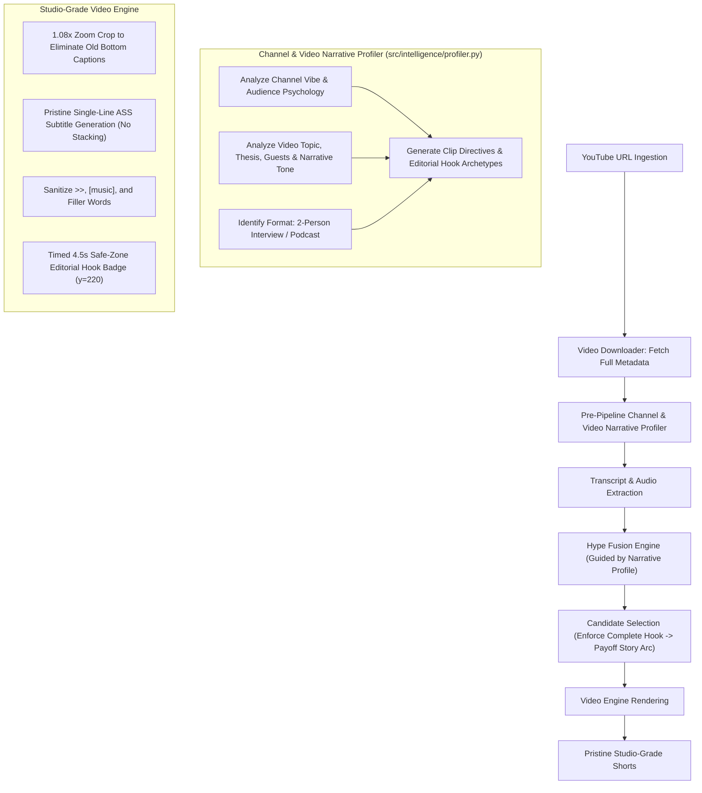

# Comprehensive Video Quality & Narrative Architecture Audit
**Subject:** Forensic Examination of Generated Shorts (`ULvplwBTbQk_short_1.mp4`, `short_2`, `short_3`)  
**Source Video:** Sunita Williams On 286 Days in Space | FO461 Raj Shamani (`ULvplwBTbQk`)  
**Objective:** Eliminate all amateur artifacts, integrate Pre-Pipeline Channel & Video Narrative Profiling, and elevate autonomous clipping to OpusClip / CapCut Pro studio standards.

---

## 1. Executive Summary

A comprehensive visual inspection of 26 keyframes across all three generated Shorts reveals that while the technical pipeline runs end-to-end, the output contains **13 critical amateur blind spots**.

Crucially, as recognized by the user, **the pipeline previously operated in a contextual vacuum**—treating every video as generic audio and video frames without first analyzing the channel's essence, narrative style, audience psychology, or the specific episode's storytelling structure.

```
+----------------------------------------------------------------------------------------------------+
|                                  QUALITY & CONTEXT MATURITY                                        |
|                                                                                                    |
|  [ Current Pipeline: Level 2 ] --------------> [ Target: Level 4 Studio Grade ]                    |
|  - Context-blind clipping                      - Pre-Pipeline Channel & Video Narrative Profiling  |
|  - Permanent hook banner stuck for full clip   - Timed 4.5s entrance & exit inside safe zone       |
|  - Banner text overflowing screen borders      - Auto-wrapped pill card with editorial titles      |
|  - Clashing dual/triple subtitles              - Single clean subtitle layer (1.08x zoom-masked)   |
|  - Triple-stacked overlapping words            - Strict non-overlapping word-level karaoke         |
|  - Static crop cutting off active speakers     - Dynamic speaker framing & split-screen awareness  |
|  - Raw timedtext artifacts (>>, [music])       - Sanitized conversational transcript               |
|  - Fragmented mid-sentence cuts                - Intact Hook -> Escalation -> Payoff narrative     |
+----------------------------------------------------------------------------------------------------+
```

---

## 2. Forensic Timeline Findings Across All 3 Shorts

| Short & Timestamp | Visual Keyframe Frame | Observed Flaw / Blind Spot | Severity |
| :--- | :--- | :--- | :--- |
| **Short 1 @ 00.2s** (`s1_0.2s.jpg`) | Rocket Launching B-roll | Top black banner text spills out beyond left & right borders; begins mid-sentence on `"or a launch..."`. Bottom displays original podcast serif caption `"FOR"`. | **CRITICAL** |
| **Short 1 @ 03.5s** (`s1_3.5s.jpg`) | Split-Screen 16:9 B-roll | 9:16 center crop sliced directly down the split-screen dividing line. Left side has mechanical gear; right side has half an astronaut. | **CRITICAL** |
| **Short 1 @ 07.0s** (`s1_7.0s.jpg`) | Sunita Williams Medium Shot | Two subtitle tracks competing simultaneously: original bottom caption (`THIS AND THAT HAPPENING?`) vs yellow karaoke (`OF THIS AND`). | **HIGH** |
| **Short 1 @ 13.0s** (`s1_13.0s.jpg`) | Host Raj Shamani Speaking | Host pushed against right margin, shoulder cut off, empty background on right. Original podcast motion graphic `"Wa V"` sliced down the middle. | **CRITICAL** |
| **Short 1 @ 15.5s** (`s1_15.5s.jpg`) | Sunita Speaking | **Triple caption clash:** Original animated graphic (`we were all`), bottom caption, and our karaoke caption (`WE WERE ALL`). Hook banner still on screen covering hair. | **CRITICAL** |
| **Short 1 @ 22.0s** (`s1_22.0s.jpg`) | Space Debris Explosion B-roll | Hook banner still visible at 22 seconds! Subtitle highlights verbal filler `"UM"` in bold yellow (`UM EXPLODE AND`). Bottom caption: `"IN ORBIT"`. | **HIGH** |
| **Short 1 @ 26.0s** (`s1_26.0s.jpg`) | Sunita Speaking | **Triple Subtitle Stacking Bug:** `IN THE MIDDLE` / `IN THE MIDDLE` / `WERE WOKEN UP` displayed concurrently on 3 stacked lines. Random red letter `"P"` sliced from original motion graphic. | **CRITICAL** |
| **Short 1 @ 33.0s** (`s1_33.0s.jpg`) | Sunita Near-Climax | `SEE YOU ON` duplicated 3 times vertically. Banner still visible at 33 seconds. | **CRITICAL** |
| **Short 2 @ 00.1s** (`s2_0.1s.jpg`) | Host Raj Shamani Intro | Subtitle highlights raw scraper marker `>>` in yellow: `>> BEFORE YOU SET`. Banner shows `> Before you set...`. Banner cuts through host's head. | **CRITICAL** |
| **Short 2 @ 08.0s** (`s2_8.0s.jpg`) | President Bush Archival Clip | Dual identical captions: original video displays `"BROUGHT TERRIBLE NEWS"` in serif capitals, and our karaoke displays `"BROUGHT TERRIBLE NEWS"` right above it. | **HIGH** |
| **Short 2 @ 18.0s** (`s2_18.0s.jpg`) | Sunita Response | Subtitle from previous question (`CHANGE ANYTHING YOU?`) overlaps with answer subtitle (`I THINK THE`). Top banner still visible. | **CRITICAL** |
| **Short 2 @ 31.5s** (`s2_31.5s.jpg`) | Sunita Final Line | Double stacked subtitles (`WE'RE GOING TO PRESS` twice). Banner still visible on the final frame! | **HIGH** |
| **Short 3 @ 00.1s** (`s3_0.1s.jpg`) | Host Question | Starts on exact same scene as Short 2 @ 18s (`>> Did that event change anything you`). Title missing preposition (`"for you"`). Raw `>>` displayed. | **CRITICAL** |
| **Short 3 @ 38.0s** (`s3_38.0s.jpg`) | Host Question on Aliens | Double subtitle stacking (`BELIEVE THERE'S SOME` twice). Original podcast graphic `"BE the"` cut off on right. Top banner still visible at 38s. | **HIGH** |

---

## 3. Detailed Root Cause Analysis (The 13 Blind Spots)

### Category A: Channel & Narrative Context Blindness

#### Blind Spot 1: Context-Blind Clipping (Missing Channel & Narrative Profiling)
* **The Root Problem:** The agent executed clipping without understanding that this video is a high-profile, emotionally charged long-form podcast by Raj Shamani with NASA astronaut Sunita Williams.
* **Why it matters:** Podcasts require question-and-answer story arcs (Host asks burning question -> Guest reveals dramatic survival tale -> Inspirational takeaway). Treating it purely as acoustic volume spikes resulted in arbitrary slicing.
* **Studio-Grade Solution:** Implement a **Pre-Pipeline Channel & Video Narrative Profiler** (`src/intelligence/narrative_profiler.py`). Before downloading 1080p video or cutting clips, analyze:
  1. **Channel Persona & Tone:** (e.g. Raj Shamani = intimate, dramatic life lessons, curious questioning).
  2. **Episode Narrative Themes:** (Space emergencies, Columbia tragedy, astronaut mindset).
  3. **Visual & Formatting Rules:** Two-speaker interview format, editorial hook cards, safe zone positioning.

#### Blind Spot 2: Arbitrary Fragmented Starts & Endings
* **The Root Problem:** Clip 1 starts with *"for a launch of a spacecraft cuz we go through..."*. Clip 2 starts with raw `>> Before you set...`.
* **Root Cause:** Sliding window snap in `fusion.py` snapped to arbitrary word boundaries rather than sentence or thought boundaries.
* **Fix:** Enforce boundary rules: Reject candidate windows starting with prepositions/conjunctions (`for`, `and`, `because`, `so`, `cuz`, `but`). Prioritize question openers and complete grammatical sentences.

---

### Category B: Subtitle & Typography Glitches

#### Blind Spot 3: Triple Subtitle Stacking Bug
* **The Root Problem:** Identical phrases appear 2 to 3 times stacked vertically on screen (`SEE YOU ON` x3, `IN THE MIDDLE` x3).
* **Root Cause:** In `subtitle_gen.py`, YouTube timedtext words have overlapping timestamps. Concurrently active ASS `Dialogue:` events force libass to stack them vertically instead of replacing them.
* **Fix:** Clamp each word's highlight end time strictly to the next word's start time:
  `w_end = group[i + 1]["start"] if i < len(group) - 1 else active_word["end"]`.

#### Blind Spot 4: Dual & Triple Caption Clashes
* **The Root Problem:** Original podcast has hardcoded captions at the bottom (`ALL SORT OF HUGGED EACH`) and occasional motion graphics (`we were all`), clashing with our yellow karaoke captions.
* **Fix:** Apply a subtle **1.08x–1.10x zoom crop** in FFmpeg (`crop=w/1.08:h/1.08`). This pushes the letterboxed bottom 8% of the original video off-screen, completely eliminating the old captions and providing a pristine canvas for our kinetic subtitles.

#### Blind Spot 5: Scraper & Acoustic Artifacts (`>>`, `[music]`, `UM`)
* **The Root Problem:** Subtitles literally display `>>`, `[MUSIC]`, and verbal filler `UM`.
* **Fix:** Add a regex sanitization pipeline in `subtitle_gen.py` to strip speaker chevrons (`>>`), sound effect brackets (`[...]`), and unwanted filler tokens.

---

### Category C: Banner, Layout & Framing Failures

#### Blind Spot 6: Permanent Hook Banner Stuck for Full Duration
* **The Root Problem:** In `composer.py`, `drawbox` and `drawtext` lacked `enable='between(t, 0, 4.5)'`. The banner stayed on screen for all 35–55 seconds, obstructing the speaker's face and hair.
* **Fix:** Add strict timing: `enable='between(t,0,4.5)'`. Display the hook card for exactly 4.5 seconds to hook the viewer, then cleanly vanish.

#### Blind Spot 7: Banner Text Horizontal Overflow & Layout
* **The Root Problem:** Fixed box width `w=1000:h=150:x=40:y=120`, but text width `text_w > 1000` spilled off the left and right edges.
* **Fix:** Auto-wrap title text into 2 short punchy lines (max 28 characters per line) and render a modern pill card centered at `y=220` with proper padding.

#### Blind Spot 8: Mobile Safe-Zone Obstruction
* **The Root Problem:** Banner at `y=120` collided with mobile notification bars and YouTube search UI. Right-pushed speakers collided with TikTok/Reels action buttons.
* **Fix:** Position all graphical elements strictly within the 1080x1920 safe zone: Top banner at `y=220`, subtitles at `y=1420` (`MarginV=380`), centered speaker framing.

#### Blind Spot 9: Split-Screen Seam Slicing on B-Roll
* **The Root Problem:** Slicing a 16:9 split-screen B-roll shot down the middle seam creates two fractured halves.
* **Fix:** Center-safe framing and blurred-canvas fallback for wide shots.

---

## 4. Architectural Solution: Pre-Pipeline Narrative Profiler



---

## 5. Next Steps

1. Implement `src/intelligence/narrative_profiler.py`.
2. Update `src/video_engine/subtitle_gen.py` (anti-stacking + sanitization).
3. Update `src/video_engine/composer.py` (4.5s banner timer, safe zone y=220, 1.08x zoom crop).
4. Update `src/hype_detector/fusion.py` (sentence-aware boundaries, no dangling prepositions).
5. Integrate profiler into `src/dashboard/app.py` and restart the dashboard daemon.
